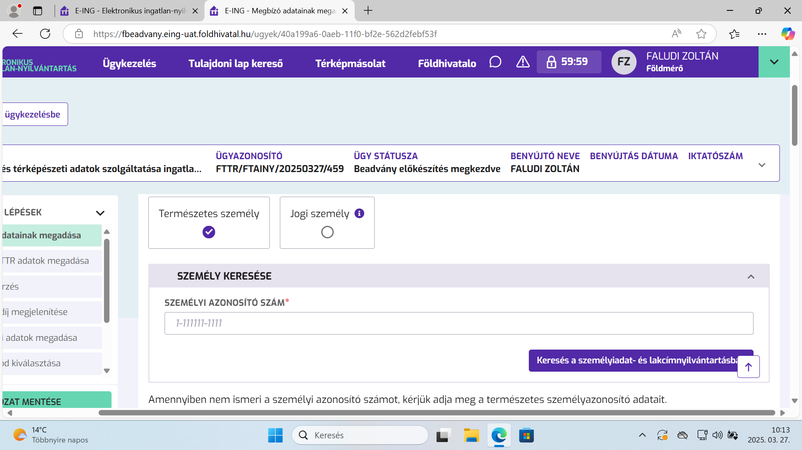
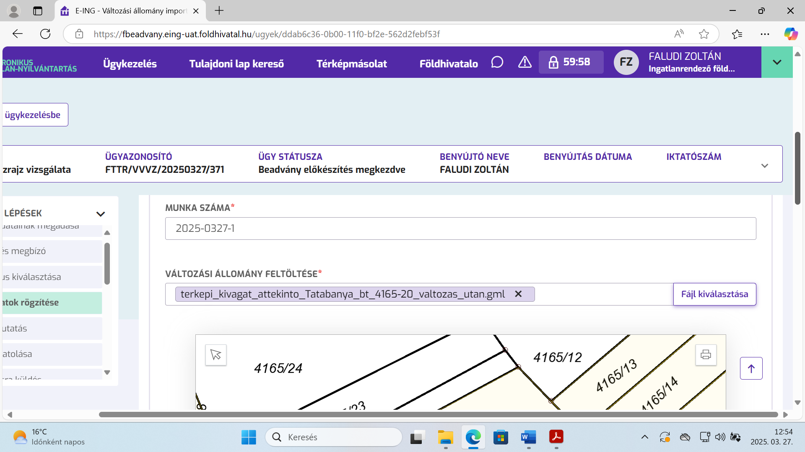
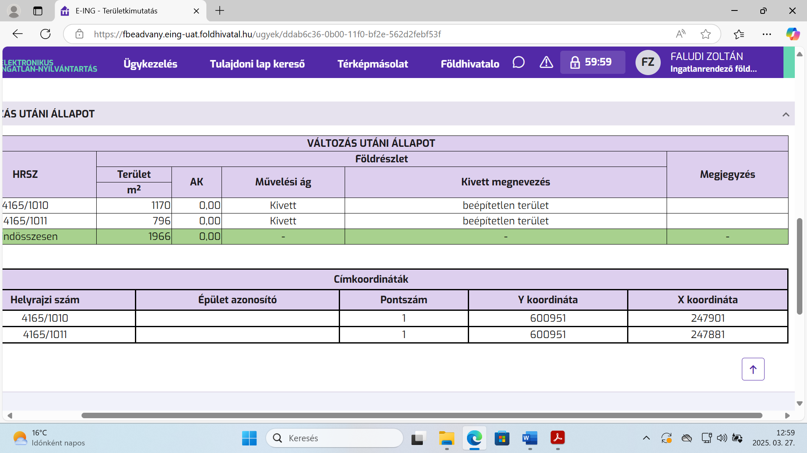
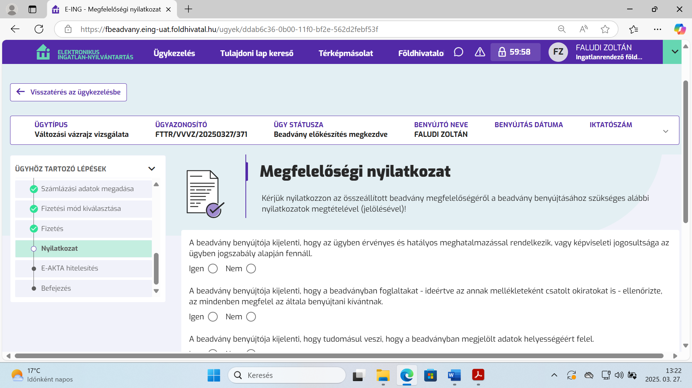
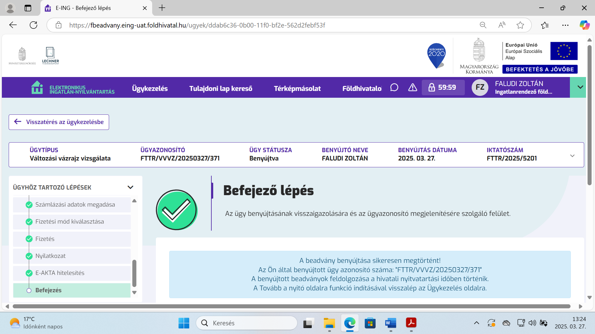

# EING / FTTR modul konzultáció
## 2025.03.27 – Lechner Tudásközpont
[Faludi Zoltán / INTELLIGEO Kft](https://intelligeo.hu)

## Földmérési ügyek
- Vizsgálat, záradékolás, újrazáradékolás
- Törlés előzetes nyilvántartásból
- Felmérési, térképezés vagy területszámítási hiba bejelentés
- Műszaki határkiigazítás (csinált már ilyet valaki?)
- Szakfelügyelői vélemény kérés IRM-hez
- Adatszolgáltatás ingatlan-nyilvántartási célra
- Adatszolgáltatás igazságügyi szakértői tevékenységhez
- Adatszolgáltatás **egyéb** célra
- Térképmásolat, iratmásolat

## Adatszolgáltatás

- Jogosultság megadása: megbízás alapján
- A megíbzót azonosítani kell személyi szám vagy a 4T adat alapján: név, születési hely és idő, anyja neve
- Adat igénylés: hrsz vagy cím alapján, térképi kijelöléssel
- Csak bankkártyás fizetés lehetséges
- Kérelem → e-akta (*.es3) →letöltés → elektronikus aláírás → feltöltés → tovább

## Szerkesztés

- FreeTR: https://freetr.hu
- QGIS: https://qgis.org
  - GML import plugin: https://github.com/faludiz/qgis-gml-plugin-import_v10
- FFTR: https://fftr.hu
- ITR: ???
- YouTube (QGIS, FreeTR): https://www.youtube.com/@faludiz

## Záradékolás

- Meg kell adni a készítőt és a minőség tanúsítót
- Ha nem egyezik:
  - a minőség tanúsító értesítést kap,
  - vizsgál, dönt, hogy továbbengedi, vagy visszaadja javításra
- Változási állomány + munkarészek feltöltése egyenként!
- Kész, az ügy bekerül az országos munkakosárba
- Onnan a helyi földhivatalba
- Az osztályvezető szignálja az ügyintézőre a feladatot

## Területkimutatás, egyebek

- Amit lehet átvesz a GML változási állományból
- Községi gyűjtőt kell alkalmazni minden esetben
- A kivett megnevezéseket listából szépen ki lehet válogatni
- Minden bejegyzett szolgalmi és vezetékjoghoz külön vázlatot kell felölteni
- Nem kell külön kérelem a soron kívüli záradékoláshoz, elég csak bejelölni
- E-akta → letöltés → elektronikus aláírás → feltöltés

## Telekalakítási engedélyezési eljárás indítása

- Jelenleg csak magánszemélyként lehetséges
- Meg kell adni a záradékolás iktatószámát
- Fel kell tölteni a telekalakítási helyszínrajzot
- Fel kell tölteni az esetleges hozzájárulásokat
- E-akta → letöltés → aláírás → feltöltés → kész

## Társasház

- Egyesével rögzíteni kell a szinteket
- A szintekhez fel kell tölteni az alaprajzot GML vagy DXF-ben, és PDF-ben
- A szintekhez fel kell venni az EÖI-ket a területükkel
- Az EÖI-khez fel kell venni a tartozékaikat a területükkel
- Külön rögzíthetők a közös tulajdonú építményrészek
- Fel kell rögzíteni a címkoordinátákat
- Okiratok = munkarészek (itt is)
- E-akata → letöltés → aláírás → feltöltés → kész

## Elektronikus aláírás

- Ahány vállalkozásban dolgozunk, annyi fizetős(!) elektronikus aláírás kell majd
- A jogosultság nem céghez, hanem magánszemélyhez kötődik
- WTF? A kétfaktoros azonosítás (ügyfélkapu+, DÁP) miért nem elég?

Update / [Mike Krisztina](https://www.facebook.com/groups/geodezia/posts/29323992297184519?comment_id=29325152433735172&reply_comment_id=29331324769784605)

- nem kell vállakozásonként külön aláírás,
- de magánszemélyként nem lehet aláírni, tehát a DÁP sem lesz jó erre
- szakmai célú aláírás kell kell ehhez

